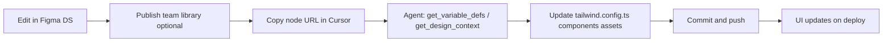

# Bestie.mx — Design System (Figma ↔ Repo)

This document defines what a SaaS design system mapped to a codebase should contain, what exists in Figma today, and how to keep Figma and `bestie.mx` in sync through Cursor.

## What a repo-linked SaaS design system should include

| Layer | Figma | Repository | Purpose |
| --- | --- | --- | --- |
| **Foundations** | Variables (color, spacing, radius), text styles, effect styles | `tailwind.config.ts`, `src/index.css` | Single source of visual truth |
| **Brand** | Logo lockups, marks, app icon, voice notes | `public/brand/`, `.cursor/rules/bestie-brand.mdc` | Identity + usage rules |
| **Icons** | Filter / attribute icon components | `src/assets/icons/`, `GenderFilterIcons.tsx` | Search filters, listing badges |
| **Components** | Published component library (Button, Input, Chip, Card, …) | `src/components/*` | Reusable UI patterns |
| **Patterns / screens** | User-flow frames (separate file) | `src/pages/*`, `docs/figma/flows/` | End-to-end journeys |
| **Documentation** | Cover, Getting Started, token swatches | This file + brand rule | Onboarding + audit |
| **Mappings** | Code syntax on variables, Code Connect (optional) | `src/figma/*.figma.ts`, `figma.config.json` | Dev Mode + automated handoff |

**Best practice:** variables and components live in a **dedicated Design System file**. Screen captures and flow placeholders stay in the **User flows** file so agents do not mix library edits with page captures.

---

## Figma files

| File | fileKey | Role |
| --- | --- | --- |
| **[Bestie.mx — Design System](https://www.figma.com/design/JVO8AoBQ5FJqfvtJXCe6Mv/Bestie.mx-%E2%80%94-Design-System)** | `JVO8AoBQ5FJqfvtJXCe6Mv` | Tokens, components, brand, icons |
| **[Bestie.mx — User flows](https://www.figma.com/design/tW5pbD3Cd7rycSLMtIzdAm/Bestie.mx-%E2%80%94-User-flows--screens-)** | `tW5pbD3Cd7rycSLMtIzdAm` | Screen-by-screen UI + MCP captures |

Machine-readable state: [`dsb-state.json`](./dsb-state.json).

---

## What's in the Design System file (v1)

### Variable collections

- **Primitives** — raw palette (forest, lime, mint, slate, gold, …)
- **Color** — semantic tokens with **Light / Dark** modes, aliased to primitives  
  WEB code syntax uses Tailwind paths, e.g. `theme(colors.primary.DEFAULT)`
- **Spacing** — 4px grid (`spacing/1` … `spacing/12`)
- **Radius** — `radius/none`, `sm`, `md`, `lg`, `2xl`, `full`

Semantic colors mirror `tailwind.config.ts`: `primary`, `secondary`, `accent`, `surface`, `body`, `muted`, `border`, `warning`, `error`, `gold`, etc.

### Text styles (Inter)

Hero, H1–H3, Body, Label, Caption, Overline, Button — aligned with `.cursor/rules/bestie-brand.mdc` §7.

### Components (v1)

| Component | Figma page | Code mapping |
| --- | --- | --- |
| **Button** | Components / Button | Inline Tailwind CTA patterns (no shared `Button.tsx` yet) |
| **Input / Text** | Components / Input & Chip | Search + form inputs |
| **Chip / Filter** | Components / Input & Chip | City / filter chips (plain pill, no icon slot) |
| **Chip / Filter Icon** | Components / Input & Chip | Icon + label toggle chip, `Default`/`Active` variants — `IconOption` in `SearchAdvancedSheet.tsx`, `SearchFilterRail.tsx` chips |
| **Tabs / Segment** | Components / Tabs | Icon + label tab with optional active-filter dot, `Default`/`Active` variants — the tab bar in `SearchAdvancedSheet.tsx` |
| **Card / Surface** | Components / Card | Home feature cards, panels |
| **Logo mark & lockup** | Components / Brand | `BrandLogo.tsx`, `public/brand/*` |
| **Filter icons** | Components / Filter Icons | `GenderFilterIcons.tsx`, `src/assets/icons/*`, plus lucide icons documented per `searchQuickAttributes.tsx` (`tag-aire-acondicionado`, `tag-parejas`, `tag-fumar-permitido-recamara` added for the Filtros avanzados redesign). Note: the `recamara` "Tipo de propiedad" chip/icon was removed from the product (redundant with "Tipo de habitación" Privada/Compartida) — the Figma frame for it may still exist as an orphaned asset. |
| **Publisher / StatusBadge** | Components / Publisher (add) | `ListingStatusBadge.tsx` — semantic pills for draft / published / paused / archived |
| **Publisher / ListingThumb** | Components / Publisher (add) | `ListingThumb.tsx` — 64×64 square thumb + Home fallback |
| **Publisher / MissingFieldsCallout** | Components / Publisher (add) | `MissingFieldsCallout.tsx` — warning callout before draft publish |
| **Publisher / ListingPropertyCard** | Components / Publisher (add) | `ListingPropertyCard.tsx` — one card for mobile + desktop; On/Off switch, rooms accordion with per-room occupancy switch |
| **Publisher / ReferenceChip** | Components / Publisher (add) | `ListingReferenceChip.tsx` — copyable `P…` / `A…` refs |
| **Dialog / Confirm** | Components / Dialog | `AppConfirmDialog.tsx` — `intent="default" \| "danger"`, focus trap + restore |

### Foundations docs

- Cover, Getting Started (sync workflow)
- Color swatches (variable-bound)
- Typography specimens
- Spacing & Radius collection (variables only)

---

## Figma → Repo workflow (your expected loop)

### 1. Edit in Figma

Change variables, components, or brand assets in **Bestie.mx — Design System**.

### 2. Publish (recommended when components change)

In Figma: **Assets → Publish** for the Design System file so User flows can consume the library.

### 3. Sync via Cursor prompt

Paste a **node URL** (`?node-id=…`) and ask explicitly what to sync. Examples:

**Token change**

> Sync color token `color/primary` from this Figma node to `tailwind.config.ts` and verify `.cursor/rules/bestie-brand.mdc` still matches.

Agent tools: `get_variable_defs`, read `tailwind.config.ts`, patch hex values.

**Component change**

> Implement this Button variant from Figma in the repo — match spacing, radius, and semantic colors.

Agent tools: `get_design_context`, `get_screenshot`, update Tailwind classes in target components or add a shared component.

**Brand asset change**

> Export updated logo from Figma and replace `public/brand/logo-lockup.svg`; keep `BrandLogo.tsx` variants in sync.

**Icon change**

> Replace `src/assets/icons/gender/mixed.png` from the Figma Filter Icons page and audit `GenderFilterIcons.tsx` sizes.

### 4. Verify

- `npm run build`
- Spot-check affected routes
- Legal docs: only if data collection or branding obligations change (see `.cursor/rules/legal-docs-review.mdc`)

### 5. Commit + deploy

Changes take effect after merge to `main` and deploy — same as any other UI change.

---

## Repo → Figma workflow

When code changes first (common during development):

1. Update `tailwind.config.ts` / components in the repo.
2. In Cursor: ask to **reconcile Figma variables** from code (agent uses `use_figma` to update variable values and code syntax).
3. Optionally re-capture screens into User flows (`VITE_FIGMA_CAPTURE=1`, see [`README.md`](./README.md)).

**Source-of-truth rule:** For Bestie v1, **`tailwind.config.ts` wins** on conflict unless you explicitly decide Figma leads for a token during a redesign.

---

## Code Connect (optional, next step)

Figma Code Connect maps components to code snippets for Dev Mode. This repo includes a starter `figma.config.json`. Full Code Connect requires:

- Components **published** to the team library
- `@figma/code-connect` CLI (Org/Enterprise for some features; MCP templates work on Pro for mapping files)

Starter mappings live in `src/figma/` (add `.figma.ts` files as components stabilize).

---

## Gap analysis (v1)

| In repo, not yet full DS | In Figma DS, not yet in code |
| --- | --- |
| Shared `Button.tsx` primitive | Published library (manual step) |
| Plain-lucide filter icons still undocumented in Figma (`Bath`, `CarFront`, `Armchair`, `PawPrint`, `House`, `Building2`, `Warehouse`, `DoorClosed` render fine in code via `searchQuickAttributes.tsx` but only the tinted-PNG icons + the 4 new 2026-07 additions have Figma swatches) | Dark-mode swatch page |
| Listing card, map chrome, wizard stepper | Full molecule set |
| Messenger / OAuth brand buttons | Motion / pulse-ring spec frame |
| `Chip / Filter Icon` and `Tabs / Segment` use a representative icon/label only (House / Propiedad) instead of `INSTANCE_SWAP` — fine for a small, stable icon set, but revisit with instance-swap if the icon count grows | — |

---

## Agent checklist (design-system tasks)

- [ ] Confirm fileKey `JVO8AoBQ5FJqfvtJXCe6Mv` (DS) vs `tW5pbD3Cd7rycSLMtIzdAm` (flows)
- [ ] Use `get_variable_defs` for token sync, `get_design_context` for components
- [ ] Never paste arbitrary hex — use semantic Tailwind tokens
- [ ] Audit icon filter rendering path if icon assets change (`.cursor/rules/icon-filter-rendering-updates.mdc`)
- [ ] State ledger: update `docs/figma/dsb-state.json` after major DS changes
